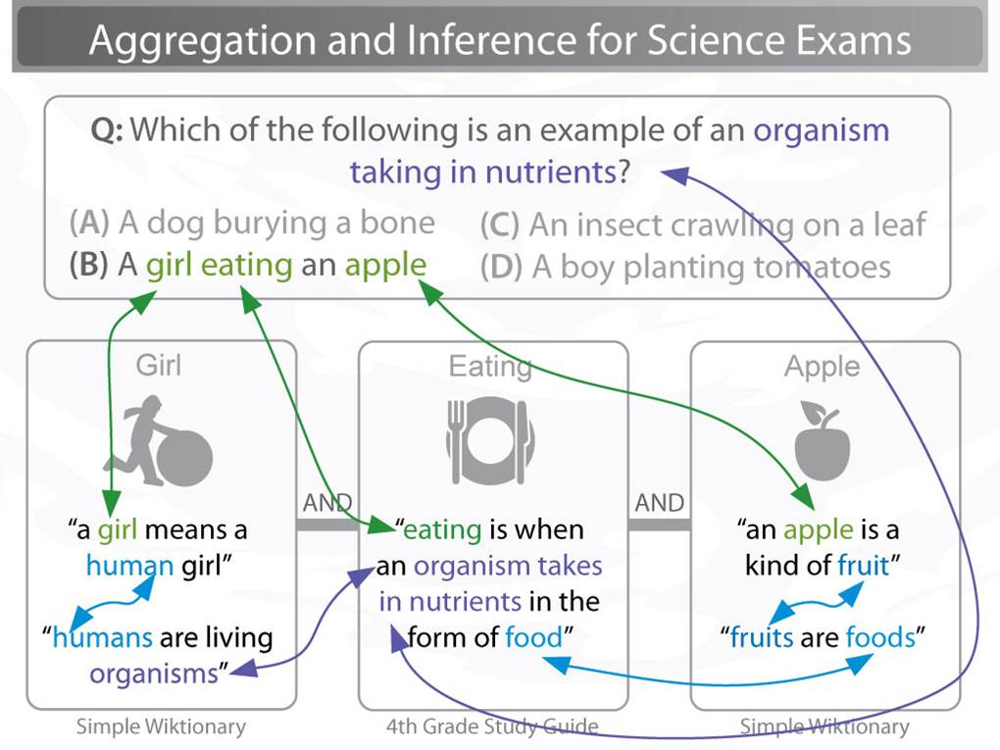
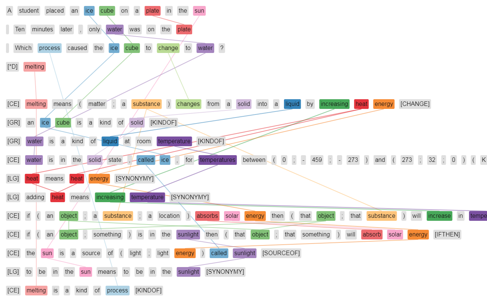
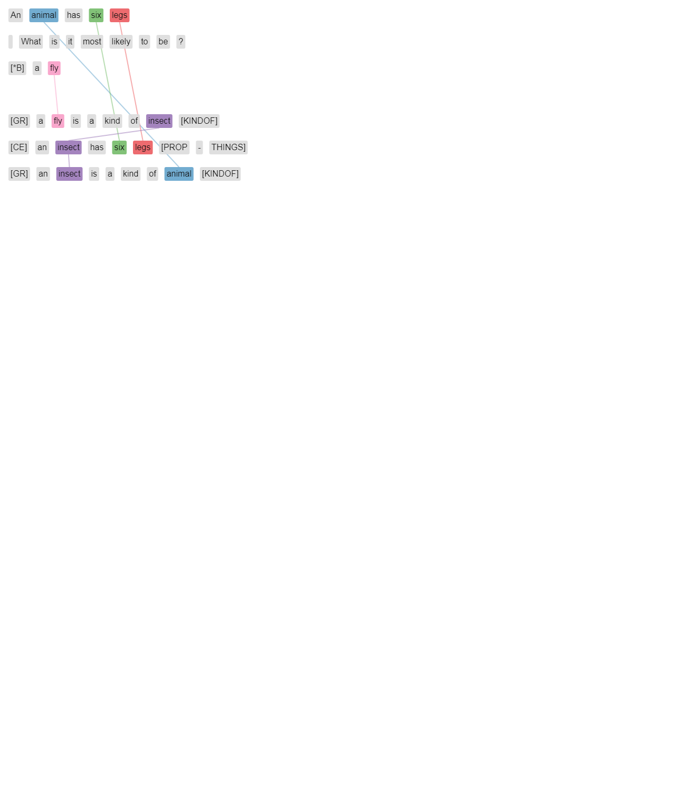
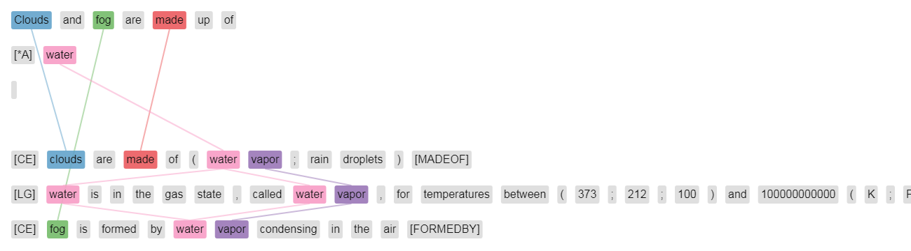
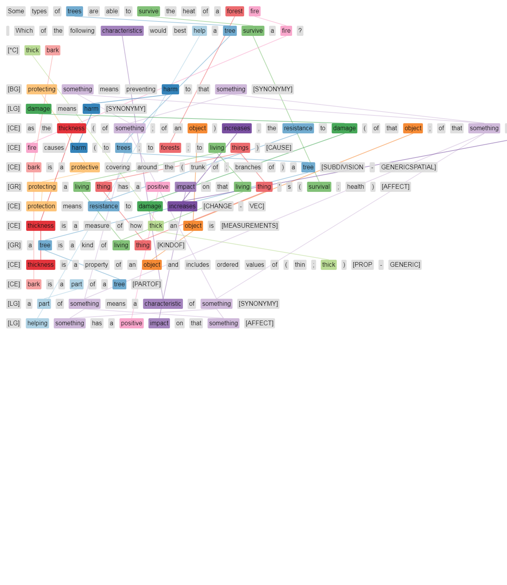

TextGraphs-13 Shared Task on Multi-Hop Inference Explanation Regeneration
=========================================================================

Overview
--------
Multi-hop inference is the task of combining more than one piece of information to solve an inference task, such as question answering.  This can take many forms, from combining free-text sentences read from books or the web, to combining linked facts from a structured knowledge base.  The Shared Task on Explanation Regeneration asks participants to develop methods to reconstruct gold explanations for elementary science questions, using a new corpus of gold explanations that provides supervision and instrumentation for this multi-hop inference task.  Each explanation is represented as an "explanation graph", a set of atomic facts (between 1 and 16 per explanation, drawn from a knowledge base of 5,000 facts) that, together, form a detailed explanation for the reasoning required to answer and explain the resoning behind a question.  Linking these facts to achieve strong performance at rebuilding the gold explanation graphs will require methods to perform multi-hop inference.  The explanations include both core scientific facts as well as detailed world knowledge, allowing this task to appeal to those interested in both multi-hop reasoning and common-sense inference.   

#### The need for multi-hop inference in question answering

Question answering can often be modeled as a retrieval task, answer sentence selection, where a method must find some sentence or short passage of text in a corpus that answers the question.  Unfortunately for complex questions it's unlikely that one can find such answer passages, even in extremely large corpora.  For example, consider the following multiple choice elementary science question:

Q: Which of the following is an example of an organism taking in nutrients?
* ( A ) a dog burying a bone
* ( B ) a girl eating an apple (Correct answer)
* ( C ) an insect crawling on a leaf
* ( D ) a boy planting tomatoes

For this question, it's highly unlikely that one could find a passage in a corpus that says "a girl eating an apple is an example of an organism taking in nutrients", even if that corpus was extremely large.  Instead, one likely has to combine a number of separate facts to successfully make this inference:
1. A girl means a human girl.
2. Humans are living organisms.
3. Eating is when an organism takes in nutrients in the form of food.
4. Fruits are kinds of foods.
5. An apple is a kind of fruit.

Combining each of these facts is often modeled as a graph traversal problem, where one must "hop" from some starting fact (say, fact 1) to other, related facts, until one has enough facts to infer the answer.  This is illustrated below: 



#### The need for explanations

Developing methods of automated inference that are able to provide users with compelling human-readable justifications for why the answer to a question is correct are critical for domains such as science and medicine, where user trust and detecting costly errors are limiting factors to adoption.  Multi-hop inference is attractive for explanation-centered inference, as the path one assembles while traversing a knowledge graph can serve as an explanation for a user.  For example:

Why is 'a girl eating an apple' an example of an organism taking in nutrients?  
Explanation: Because: A girl means a human girl. humans are living organisms.  Eating is when an organism takes in nutrients in the form of food.  Fruits are kinds of foods.  An apple is a kind of fruit.

#### Contemporary Challenges in Multi-hop Inference

**Semantic Drift:** One of the central challenges to performing multi-hop inference is that combining facts -- i.e. traversing from one fact to another in a knowledge graph -- is a noisy process, because the current signals we have for knowing whether two facts are relevant to the inference required to answer a question (and can thus be combined) are imperfect.  Often times those signals are as simple as lexical overlap -- two sentences (or nodes) in a knowledge graph sharing one or more of the same words.  Sometimes this lexical overlap helps -- for example, knowing that "an apple is a kind of [fruit]" and that "[fruits] are foods" helps answer the above question.  But often times it leads to information that isn't on context -- for example, "a [tree] is a kind of living thing" and "[trees] require sunlight to survive" likely wouldn't help answer a question about *"Q: Which adaptations help a tree survive the heat of a forest fire."*

This observation that chaining facts together on imperfect signals often leads inference to go off-context and become errorful is the phenomenon of *"semantic drift"* *(Fried et al., "Higher-order Lexical Semantic Models for Non-factoid Answer Reranking", TACL 2015)*, and has been demonstrated across a wide variety of representations and traversal algorithms.  Typically multi-hop models see small performance benefits (of between 1-5%) when aggregating 2 pieces of information, and may see small performance benefits when aggregating 3 pieces of information, then performance decreases as progressively more information is aggregated due to this "semantic drift".  

**Long Inference Chains:** Jansen et al. *("WorldTree: A Corpus of Explanation Graphs for Elementary Science Questions supporting Multi-hop Inference", LREC 2018)* showed that even inferences for elementary science require aggregating an average of 6 facts (and as many as 16 facts) to answer and explain the reasoning behind those answers when common sense knowledge is included.   With current inference models infrequently able to combine more than 2 facts, the state-of-the-art is far from this requirement.

**Multi-hop methods are not required to answer questions on many "multi-hop" datasets:** Chen and Durrett *("Understanding Dataset Design Choices for Multi-hop Reasoning", NAACL 2019)* show that it's possible to achieve near state-of-the-art performance on two popular multi-hop question answering datasets (WikiHop and HotPotQA) using baseline models that do not perform multi-hop inference.  Because new multi-hop inference algorithms are often characterized using their accuracy on the question answering task as a proxy for their capacity to perform multi-hop inference, rather than explicitly evaluating an algorithm's capacity to aggregate information by controlling the amount of information it can combine (as in Fried et al.),  we currently do not have well-controlled characterizations of the information aggregation abilities of many proposed multi-hop algorithms.

**Chance Performance on Knowledge Graphs:** Jansen *("Multi-hop Inference for Sentence-level TextGraphs: How Challenging is Meaningfully Combining Information for Science Question Answering?", TextGraphs 2018)* empirically demonstrated that semantic drift can be *overpoweringly large* or *deceptively low*, depending on the text resources used to build the knowledge graph, and the criteria used for selecting nodes.  While the chance of hopping to a relevant node on a graph constructed from sentences in an open-domain corpus like Wikipedia can be very small, using a term frequency model can increase this chance performance by orders of magnitude, increasing chance traversal performance beyond the performance of some algorithms reported in the literature.  Unfortunately evaluating the chance performance on a knowledge graph is currently a very expensive manual task, and we currently suffer from a methods problem of being able to disentangle the performance of novel multi-hop algorithms from the chance performance of a given knowledge graph.

**Explicit Training Data for Multi-hop Inference and Explanation Construction:** Because of the difficulty and expense associated with manually annotating inference paths in a knowledge base, most multi-hop inference algorithms have lacked supervision for this task, and had to resort to using other methods (such as latent machine learning algorithms) that use other signals, like answering a question correctly, as a proxy for doing well at the multi-hop inference task. 

#### The Task: Explanation Reconstruction 
Many of these contemporary methodological challenges are potentially now addressable using WorldTree, a new corpus of explicit training data designed to help instrument the multi-hop inference and explanation-construction tasks.  WorldTree contains manually assembled detailed explanations, including common-sense reasoning facts, for nearly every publicly available elementary science exam question.  Explanations are represented as a series of facts that, when combined, answer a question, and provide a detailed explanation for the answer.  Facts in an explanation explicitly connect with each other on lexical overlap -- i.e., having one or more of the same words.  Each fact is drawn from a grade-appropriate knowledge base of approximately 5,000 facts that are simultaneously represented as both free-text sentences and structured knowledge (*n-ary relations*), allowing both structured and unstructured methods to be evaluated on the same data.  Additional annotation identifies which facts are "central" to the explanation, allowing automated evaluation of an inference method's ability to combine "core scientific facts" with common-sense knowledge that grounds core science knowledge with world knowledge. 


Important Dates
---------------

* 13-05-2019: Example (trial) data release
* 17-05-2019: Training data release
* 12-07-2019: Test data release; Evaluation start
* 09-08-2019: Evaluation end
* 23-08-2019: System description paper deadline
* 11-09-2019: Deadline for reviews of system description papers
* 19-09-2019: Author notifications
* 30-09-2019: Camera-ready description paper deadline
* __03-11-2019/04-11-2019__: [TextGraphs-13 workshop](https://sites.google.com/view/textgraphs2019)

The dates are specified in the following format: `day-month-year`.

Data
----

The data used in this shared task comes from the WorldTree corpus (Jansen et al., 2018). The data includes approximately 2,200 elementary science questions drawn from the Aristo Reasoning Challenge (ARC) corpus (Clark et al., "Think you have solved question answering? Try ARC, the AI2 reasoning challenge", Arxiv).  1,680 of these questions include detailed explanation graphs for their answers, and are divided into the standard ARC train, development, and test sets.  The remaining questions that do not have gold explanation graphs required specialized reasoning (e.g. spatial, mathematical) that did not easily lend itself to the method of textual explanation used.  Each explanation is represented as a reference to one or more facts in a structured knowledge base of tables (the "tablestore").  The tablestore contains 60+ tables, each organized around a particular kind of knowledge (e.g. taxonomic knowledge, part-of knowledge, properties, changes, causality, coupled relationships).  Each "fact" is represented as one row in a given table and can be used either as a structured representation (with the n-ary relational information afforded by the columns in each table), or it can be read off directly as a free-text sentence.  The WorldTree tablestore knowledge base contains approximately 5,000 table rows/"facts", 3,600 of which are actively used in at least one explanation.  Explanation graphs commonly reuse the same knowledge (i.e. the same table row) used in other explanations.  The most common fact ("an animal is a kind of organism") is used in 89 different explanations, and approximately 1,500 facts are reused in more than one explanation.  More details, analyses, and summary statistics are provided in the WorldTree paper.  

For each explanation, the WorldTree corpus also includes annotation for *how important* each fact is towards the explanation.  There are three categories of importance:
* **CENTRAL:** These facts are at the core of the explanation, and are often core scientific concepts in elementary science.  For example, "melting means changing from a solid to a liquid by adding heat energy".
* **GROUNDING:** These facts tend to link core scientific facts in the explanation with specific examples found in the question.  For example, "ice is a kind of solid"
* **LEXICAL GLUE:** These facts tend to express synonymy or definitional relationships, potentially between short multi-word expressions, such as "adding heat means increasing heat energy".  These are used to bridge two facts in an explanation together (or, a fact in an explanation to the question or answer).  The explanation graphs in WorldTree require that explanation sentences are explicitly linked based on lexical overlap (shared words), and these lexical glue sentences tend to fill this purpose when knowledge in different facts has been expressed with different words.

Because of this annotation, it's possible to separately evaluate how many of the core/central facts, grounding facts, and synonymy relations that a given inference method reconstructs.  This would allow one to automatically determine that of two algorithms with similar performance, one primarily reconstructs more of the core/central facts, while another has a more even distribution between central, grounding, and lexical glue facts.

The dataset is available at <http://cognitiveai.org/dist/worldtree_corpus_textgraphs2019sharedtask_withgraphvis.zip>. Please note that this distribution is still subject to the terms set forth in the included license `EULA AI2 Mercury Dataset 01012018.docx`.

### Task 
Participating systems are asked to perform an *explanation reconstruction* task, a stepping-stone task towards general multi-hop inference on large graphs.  The task is as follows: Given a question and known correct answer, build a system that reconstructs the gold explanation.  For ease of evaluation (and to encourage a variety of methods, not only those involving graph-based inference), the task is framed as a ranking task  where for a given question, one must selectively rank facts in the gold explanation higher than facts not present in the gold explanation.

### Follow-through Example
Given the following question (top) and it's gold explanation graph (bottom):


An example of ranking each of the ~5000 sentences in the Tablestore knowledge base to attempt to rebuild this explanation is as follows.  We see that some of the gold explanation sentences are ranked near the top (e.g. melting is a kind of process (rank 1), an ice cube is a kind of solid (rank 7), melting means changing from a solid to a liquid by adding heat energy (rank 18)). A number of other sentences in the gold explanation are ranked much lower (53, 102, 384, 408, 858, 860, 3778, 3956).  The mean average precision for this ranking on this question is 0.148.  When considering only the central questions in the explanation, the mean average precision increases to 0.195.


```
Question: A student placed an ice cube on a plate in the sun. Ten minutes later, only water was on the plate. Which process caused the ice cube to change to water?
mcAnswer[0]: condensation	mcAnswer[1]: evaporation	mcAnswer[2]: freezing	mcAnswer[3]: melting	
Correct Answer Candidate: 3 (melting)

Sentences in Gold Explanation (Table Rows):
	6abc-4443-f672-9a97 	CENTRAL 	melting means changing from a solid into a liquid by adding heat energy
	a1a9-97db-a771-1c2b 	GROUNDING 	an ice cube is a kind of solid
	3961-d09c-4b9a-a6f7 	GROUNDING 	water is a kind of liquid
	4a5a-9115-28a9-b97b 	CENTRAL 	water is in the solid state , called ice , for temperatures between 0 ; -459 ; -273 and 273 ; 32 ; 0 K ; F ; C
	4710-c993-7a19-bef2 	LEXGLUE 	heat means heat energy
	7d37-b81d-0cf3-9ae0 	LEXGLUE 	adding heat means increasing temperature
	9554-47d7-c095-1df7 	CENTRAL 	if an object ; a substance absorbs solar energy then that object ; that substance will increase in temperature
	e00a-03fe-d978-1a27 	CENTRAL 	if an object ; something is in the sunlight then that object ; that something will absorb solar energy
	a538-175f-9223-d117 	CENTRAL 	the sun is a source of light ; light energy called sunlight
	8939-25ca-fb9c-d790 	LEXGLUE 	to be in the sun means to be in the sunlight
	36f6-e94f-8780-1897 	CENTRAL 	melting is a kind of process


Explanation Regeneration Task: Baseline Model's Ranks for Table Rows/Sentences: 
(* denotes a ranked sentence is part of the gold explanation)
1 	[COS_A:0.707, COS_Q:0.107, ] 	* melting is a kind of process
2 	[COS_A:0.707, COS_Q:0.000, ] 	thawing is similar to melting
3 	[COS_A:0.577, COS_Q:0.080, ] 	melting is a kind of phase change
4 	[COS_A:0.604, COS_Q:0.000, ] 	melting is when solids are heated above their melting point
5 	[COS_A:0.413, COS_Q:0.117, ] 	amount of water in a body of water increases by storms ; rain ; glaciers melting ; snow melting ; ice melting
6 	[COS_A:0.000, COS_Q:0.428, ] 	an ice cube is a kind of object
7 	[COS_A:0.000, COS_Q:0.428, ] 	* an ice cube is a kind of solid
8 	[COS_A:0.453, COS_Q:0.000, ] 	freezing point is similar to melting point
9 	[COS_A:0.447, COS_Q:0.000, ] 	melting point is a property of a substance ; material
10 	[COS_A:0.408, COS_Q:0.000, ] 	glaciers melting has a negative impact on the glaicial environment
11 	[COS_A:0.000, COS_Q:0.296, ] 	plate tectonics is a kind of process
12 	[COS_A:0.354, COS_Q:0.000, ] 	sometimes piles of rock are formed by melting glaciers depositing rocks
13 	[COS_A:0.354, COS_Q:0.000, ] 	melting point can be used to identify a pure substance
14 	[COS_A:0.000, COS_Q:0.260, ] 	ice crystals means ice
15 	[COS_A:0.236, COS_Q:0.069, ] 	the freezing point of water ; melting point of water is 32F ; 0C ; 273K
16 	[COS_A:0.318, COS_Q:0.000, ] 	the melting point of iron is 2800F ; 1538C ; 1811K
17 	[COS_A:0.318, COS_Q:0.000, ] 	the melting point of oxygen is -361.8F ; -218.8C ; 54.4K
18 	[COS_A:0.318, COS_Q:0.000, ] 	* melting means changing from a solid into a liquid by adding heat energy
19 	[COS_A:0.290, COS_Q:0.000, ] 	adding salt to a liquid decreases the melting point of that liquid
20 	[COS_A:0.000, COS_Q:0.214, ] 	ice is a kind of food
(note, only top 20 ranked table rows shown)
Ranks of gold rows: 1, 7, 18, 53, 102, 384, 408, 858, 860, 3778, 3956

Scoring Metrics:
 Average Precision: 0.14862461238725275
 
Scoring Metrics (by explanation sentence role): 
 Average Precision (CENTRAL): 0.19516123051492149
 Average Precision (GROUNDING): 0.10294117647058823
 Average Precision (LEXGLUE): 0.0012593148624291516
 
Scoring Metrics (by whether a gold sentence has lexical overlap w/question or answer): 
 Average Precision (LEXOVERLAP): 0.20264768732550112
 Average Precision (NOLEXOVERLAP): 0.004046859466057559
 
Scoring Metrics (Precision@N):
 Precision@1: 1.000
 Precision@2: 0.500
 Precision@3: 0.333
 Precision@4: 0.250
 Precision@5: 0.200
```

### Evaluation 
Participating systems will be evaluated using mean average precision (MAP) on the explanation reconstruction task.  The example code provided calculates this, both overall, as well as broken down into specific sub-measures (e.g. the role of sentences in an explanation, and whether a sentence has lexical overlap with the question or answer).

Participants are also encouraged, but not required, to report the following measures with their systems: 
1. A histogram of explanation reconstruction performance (MAP) versus the length of the gold explanation being reconstructed
2. If also using the data to perform the QA task, reporting overall QA accuracy as well as explanation reconstruction accuracy for correctly answered questions
3. Though the Worldtree corpus was constructed to automate explanation evaluation, it is still possible some facts may be highly relevant but not included in an explanation.  An error analysis of the final system is strongly encouraged to determine the proportion of errors that are genuine errors of various categories, and the proportion of errors that are "also good" explanation sentences. 

### Baselines

The shared task data distribution includes a baseline that uses a term frequency model (tf.idf) to rank how likely table row sentences are to be a part of a given explanation.  The performance of this baseline on the development partition is 0.054 MAP.   Baselines for both Scala and Python are provided.

#### Python

```shell
$ make dataset
```

```shell
$ ./baseline_tfidf.py annotation/expl-tablestore-export-2017-08-25-230344/tables questions/ARC-Elementary+EXPL-Dev.tsv > predict.txt
```

The format of the `predict.txt` file is `questionID<TAB>explanationID` without header;
the order is important.

```shell
$ ./evaluate.py --gold=questions/ARC-Elementary+EXPL-Dev.tsv predict.txt
```

In order to prepare a submission file for CodaLab, create a ZIP file containing your `predict.txt`, cf. `make predict-tfidf.zip`.

#### Scala

A Scala tf.idf baseline that achieves a MAP of 0.28 is available at:
<https://github.com/cognitiveailab/explanationreconstructiontextgaphs2019>

## Additional Example Explanation Graphs

Explanation graphs vary in size (1-16 facts, an average of 6 facts per explanation), and in their connectivity properties.  Some are relatively simple, while others are complex.  Here are additional examples:

A straightforward chaining of facts:


An example of a list question:


An example of a hard question with many facts in the explanation, including a lot of challenging commonsense/world knowledge: 



Submission
--------------------

Please submit your solutions via CodaLab: <https://competitions.codalab.org/competitions/20150>

Contacts
--------------------

We welcome questions and answers on the shared task on GitHub: <https://github.com/umanlp/tg2019task/issues>.

To contact the task organizers directly, please send an email to [textgraphsoc@gmail.com](mailto:textgraphsoc@gmail.com).

Terms and Conditions
--------------------

By submitting results to this competition, you consent to the public release of your scores at the TextGraph-13 workshop and in the associated proceedings, at the task organizers' discretion. Scores may include, but are not limited to, automatic and manual quantitative judgements, qualitative judgements, and such other metrics as the task organizers see fit. You accept that the ultimate decision of metric choice and score value is that of the task organizers.

You further agree that the task organizers are under no obligation to release scores and that scores may be withheld if it is the task organizers' judgement that the submission was incomplete, erroneous, deceptive, or violated the letter or spirit of the competition's rules. Inclusion of a submission's scores is not an endorsement of a team or individual's submission, system, or science.

You further agree that your system may be named according to the team name provided at the time of submission, or to a suitable shorthand as determined by the task organizers.

You agree not to use or redistribute the shared task data except in the manner prescribed by its licence.

References
----------

```
@InProceedings{jansen2018worldtree,
    author = {Peter Jansen and Elizabeth Wainwright and Steven Marmorstein and Clayton T. Morrison},
    title = {WorldTree: A Corpus of Explanation Graphs for Elementary Science Questions supporting Multi-hop Inference},
    booktitle = {Proceedings of the 11th International Conference on Language Resources and Evaluation (LREC)},
    year = {2018},
    url = {http://cognitiveai.org/wp-content/uploads/2018/02/jansen_et_al_lrec2018_worldtree_computable_explanation_corpus_8pg_cameraready.pdf},
    url_code = {http://cognitiveai.org/explanationbank/}
}
```
